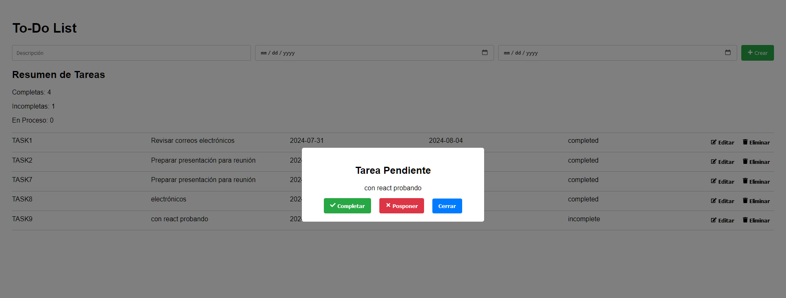

# Aplicación de Lista de Tareas en React

## Introducción

En el mundo del desarrollo web, crear una aplicación de Lista de Tareas a menudo se considera un rito de iniciación. Es un proyecto que parece simple en la superficie, pero que puede expandirse para incorporar una amplia gama de conceptos y mejores prácticas de React. Esto lo convierte en una excelente herramienta de aprendizaje para principiantes y una gran manera para que los desarrolladores más experimentados perfeccionen sus habilidades.

Este tutorial te guiará a través de la creación de una aplicación de Lista de Tareas rica en funcionalidades utilizando React. Cubriremos todo, desde la estructura básica de componentes hasta conceptos más avanzados como la gestión del estado, hooks y diseño responsivo. Al final de este tutorial, tendrás una aplicación completamente funcional y una comprensión más profunda del desarrollo en React.

## ¿Por qué crear una aplicación de Lista de Tareas?

1. **Aprender los fundamentos de React**: Este proyecto cubre conceptos básicos de React como componentes, estado, props y hooks.
2. **Practicar la gestión del estado**: Aprenderás cómo manejar y actualizar el estado de manera efectiva a través de múltiples componentes.
3. **Implementar operaciones CRUD**: Las operaciones de Crear, Leer, Actualizar y Eliminar son fundamentales en muchas aplicaciones.
4. **Explorar los Hooks de React**: Utilizaremos varios hooks como useState, useEffect y useCallback.
5. **Manejar interacciones del usuario**: Desde envíos de formularios hasta clics de botones, implementarás diversas interacciones del usuario.
6. **Diseño responsivo**: La aplicación está diseñada para funcionar bien en diferentes tamaños de pantalla.
7. **Aplicación del mundo real**: Las listas de tareas son algo que la gente usa a diario, lo que hace que este sea un proyecto práctico y relevante.

## App Funcionando:




## Prerrequisitos

Antes de comenzar este tutorial, deberías tener:

- Conocimientos básicos de HTML, CSS y JavaScript
- Node.js y npm (Node Package Manager) instalados en tu computadora
- Un editor de código (por ejemplo, Visual Studio Code, Sublime Text)
- Familiaridad básica con los conceptos de React (componentes, JSX)

## Comenzando

### Paso 1: Configurar el proyecto

1. Abre tu terminal y crea un nuevo proyecto de React:

   ```
   npx create-react-app lista-tareas-react
   ```

2. Navega al directorio del proyecto:

   ```
   cd lista-tareas-react
   ```

3. Instala dependencias adicionales:

   ```
   npm install react-icons
   ```

### Paso 2: Estructura del proyecto

Reemplaza el contenido de tu carpeta `src` con la siguiente estructura:

```
src/
│
├── componentes/
│   ├── FormularioTarea.js
│   ├── ListaTareas.js
│   ├── ElementoTarea.js
│   ├── ResumenTareas.js
│   └── ModalTarea.js
│
├── App.js
├── index.js
└── estilos.css
```

### Paso 3: Crear los componentes

Vamos a crear cada componente uno por uno:

#### App.js

Este es el componente principal que orquesta toda la aplicación.

```jsx
import React, { useState, useCallback, useEffect } from 'react';
import FormularioTarea from './componentes/FormularioTarea';
import ListaTareas from './componentes/ListaTareas';
import ResumenTareas from './componentes/ResumenTareas';
import ModalTarea from './componentes/ModalTarea';
import './estilos.css';

const App = () => {
  const [tareas, setTareas] = useState([]);
  const [tareaSeleccionada, setTareaSeleccionada] = useState(null);
  const [siguienteId, setSiguienteId] = useState(1);

  const verificarFechasLimite = useCallback(() => {
    const ahora = new Date();
    tareas.forEach(tarea => {
      if (new Date(tarea.fechaFin) <= ahora && tarea.estado !== 'completada') {
        setTareaSeleccionada(tarea);
      }
    });
  }, [tareas]);

  useEffect(() => {
    const intervalo = setInterval(() => {
      verificarFechasLimite();
    }, 5000);

    return () => clearInterval(intervalo);
  }, [verificarFechasLimite]);

  const agregarTarea = tarea => {
    const nuevaTarea = {
      ...tarea,
      id: siguienteId,
      codigo: `TAREA${siguienteId}`
    };
    setTareas(tareasAnteriores => [...tareasAnteriores, nuevaTarea]);
    setSiguienteId(idAnterior => idAnterior + 1);
  };

  const actualizarTarea = tareaActualizada => {
    setTareas(tareasAnteriores =>
      tareasAnteriores.map(tarea => (tarea.id === tareaActualizada.id ? tareaActualizada : tarea))
    );
  };

  const eliminarTarea = id => {
    setTareas(tareasAnteriores => tareasAnteriores.filter(tarea => tarea.id !== id));
  };

  const completarTarea = id => {
    actualizarTarea({ ...tareas.find(tarea => tarea.id === id), estado: 'completada' });
    setTareaSeleccionada(null);
  };

  const posponerTarea = id => {
    const nuevaFechaFin = new Date();
    nuevaFechaFin.setDate(nuevaFechaFin.getDate() + 1);
    actualizarTarea({ ...tareas.find(tarea => tarea.id === id), fechaFin: nuevaFechaFin.toISOString().split('T')[0] });
    setTareaSeleccionada(null);
  };

  const cerrarModal = () => {
    setTareaSeleccionada(null);
  };

  return (
    <div className="contenedor-app">
      <h1>Lista de Tareas</h1>
      <FormularioTarea
        agregarTarea={agregarTarea}
        tareaParaEditar={tareaSeleccionada}
        actualizarTarea={actualizarTarea}
      />
      <ResumenTareas tareas={tareas} />
      <ListaTareas
        tareas={tareas}
        actualizarTarea={actualizarTarea}
        eliminarTarea={eliminarTarea}
        setTareaSeleccionada={setTareaSeleccionada}
      />
      {tareaSeleccionada && (
        <ModalTarea
          tarea={tareaSeleccionada}
          completarTarea={completarTarea}
          posponerTarea={posponerTarea}
          onCerrar={cerrarModal}
        />
      )}
    </div>
  );
};

export default App;
```

#### FormularioTarea.js

Este componente maneja la creación de nuevas tareas.

```jsx
import React, { useState } from 'react';
import { FaPlus } from 'react-icons/fa';

const FormularioTarea = ({ agregarTarea }) => {
  const [descripcion, setDescripcion] = useState('');
  const [fechaInicio, setFechaInicio] = useState('');
  const [fechaFin, setFechaFin] = useState('');

  const manejarEnvio = e => {
    e.preventDefault();
    const nuevaTarea = {
      descripcion,
      fechaInicio,
      fechaFin,
      estado: 'incompleta'
    };
    agregarTarea(nuevaTarea);
    setDescripcion('');
    setFechaInicio('');
    setFechaFin('');
  };

  return (
    <form className="formulario-tarea" onSubmit={manejarEnvio}>
      <input
        type="text"
        placeholder="Descripción"
        value={descripcion}
        onChange={e => setDescripcion(e.target.value)}
        required
      />
      <input
        type="date"
        value={fechaInicio}
        onChange={e => setFechaInicio(e.target.value)}
        required
      />
      <input
        type="date"
        value={fechaFin}
        onChange={e => setFechaFin(e.target.value)}
        required
      />
      <button type="submit">
        <FaPlus /> Crear
      </button>
    </form>
  );
};

export default FormularioTarea;
```

#### ListaTareas.js

Este componente renderiza la lista de tareas.

```jsx
import React from 'react';
import ElementoTarea from './ElementoTarea';

const ListaTareas = ({ tareas, actualizarTarea, eliminarTarea }) => {
  return (
    <div className="lista-tareas">
      {tareas.map(tarea => (
        <ElementoTarea
          key={tarea.id}
          tarea={tarea}
          actualizarTarea={actualizarTarea}
          eliminarTarea={eliminarTarea}
        />
      ))}
    </div>
  );
};

export default ListaTareas;
```

#### ElementoTarea.js

Este componente representa un elemento individual de tarea.

```jsx
import React, { useState } from 'react';
import { FaEdit, FaTrash } from 'react-icons/fa';

const ElementoTarea = ({ tarea, actualizarTarea, eliminarTarea }) => {
  const [estaEditando, setEstaEditando] = useState(false);
  const [descripcionActualizada, setDescripcionActualizada] = useState(tarea.descripcion);
  const [fechaFinActualizada, setFechaFinActualizada] = useState(tarea.fechaFin);

  const manejarActualizacion = () => {
    actualizarTarea({ ...tarea, descripcion: descripcionActualizada, fechaFin: fechaFinActualizada });
    setEstaEditando(false);
  };

  return (
    <div className="elemento-tarea">
      {estaEditando ? (
        <>
          <input
            type="text"
            value={descripcionActualizada}
            onChange={e => setDescripcionActualizada(e.target.value)}
          />
          <input
            type="date"
            value={fechaFinActualizada}
            onChange={e => setFechaFinActualizada(e.target.value)}
          />
          <button onClick={manejarActualizacion}>Guardar</button>
        </>
      ) : (
        <>
          <span>{tarea.codigo}</span>
          <span>{tarea.descripcion}</span>
          <span>{tarea.fechaInicio}</span>
          <span>{tarea.fechaFin}</span>
          <span>{tarea.estado}</span>
          <button onClick={() => setEstaEditando(true)}>
            <FaEdit /> Editar
          </button>
          <button onClick={() => eliminarTarea(tarea.id)}>
            <FaTrash /> Eliminar
          </button>
        </>
      )}
    </div>
  );
};

export default ElementoTarea;
```

#### ResumenTareas.js

Este componente proporciona un resumen de los estados de las tareas.

```jsx
import React from 'react';

const ResumenTareas = ({ tareas }) => {
  const tareasCompletadas = tareas.filter(tarea => tarea.estado === 'completada').length;
  const tareasIncompletas = tareas.filter(tarea => tarea.estado === 'incompleta').length;
  const tareasEnProceso = tareas.length - tareasCompletadas - tareasIncompletas;

  return (
    <div className="resumen-tareas">
      <h2>Resumen de Tareas</h2>
      <p>Completas: {tareasCompletadas}</p>
      <p>Incompletas: {tareasIncompletas}</p>
      <p>En Proceso: {tareasEnProceso}</p>
    </div>
  );
};

export default ResumenTareas;
```

#### ModalTarea.js

Este componente muestra un modal para las tareas que han alcanzado su fecha límite.

```jsx
import React from 'react';
import { FaCheck, FaTimes } from 'react-icons/fa';

const ModalTarea = ({ tarea, completarTarea, posponerTarea, onCerrar }) => {
  return (
    <div className="modal-tarea">
      <div className="contenido-modal">
        <h2>Tarea Pendiente</h2>
        <p>{tarea.descripcion}</p>
        <div className="acciones-modal">
          <button onClick={() => completarTarea(tarea.id)}>
            <FaCheck /> Completar
          </button>
          <button onClick={() => posponerTarea(tarea.id)}>
            <FaTimes /> Posponer
          </button>
          <button onClick={onCerrar}>Cerrar</button>
        </div>
      </div>
    </div>
  );
};

export default ModalTarea;
```

### Paso 4: Agregar estilos

Crea un archivo `estilos.css` en la carpeta `src`:

```css
/* Contenedor principal de la aplicación */
.contenedor-app {
  padding: 20px;
  max-width: 1200px;
  margin: 0 auto;
  font-family: Arial, sans-serif;
}

/* Formulario de tareas */
.formulario-tarea {
  display: flex;
  flex-wrap: wrap;
  gap: 10px;
  margin-bottom: 20px;
}

.formulario-tarea input {
  flex: 1;
  padding: 10px;
  border: 1px solid #ccc;
  border-radius: 4px;
}

.formulario-tarea button {
  padding: 10px 15px;
  background-color: #28a745;
  color: white;
  border: none;
  border-radius: 4px;
  cursor: pointer;
}

.formulario-tarea button:hover {
  background-color: #218838;
}

/* Lista de tareas */
.lista-tareas {
  border-top: 1px solid #ccc;
  margin-top: 20px;
}

/* Elementos individuales de la lista de tareas */
.elemento-tarea {
  display: flex;
  flex-wrap: wrap;
  justify-content: space-between;
  padding: 10px 0;
  border-bottom: 1px solid #ccc;
}

.elemento-tarea span {
  margin-right: 10px;
  flex: 1;
}

.elemento-tarea button {
  background-color: transparent;
  border: none;
  cursor: pointer;
  padding: 5px 10px;
  font-weight: bold;
}

/* Botón de editar */
.elemento-tarea button.boton-editar {
  background-color: #f1c40f;
  color: black;
}

.elemento-tarea button.boton-editar:hover {
  background-color: #f39c12;
}

/* Botón de eliminar */
.elemento-tarea button.boton-eliminar {
  background-color: #e74c3c;
  color: white;
}

.elemento-tarea button.boton-eliminar:hover {
  background-color: #c0392b;
}

/* Resumen de tareas */
.resumen-tareas {
  margin-top: 20px;
}

/* Modal de tarea */
.modal-tarea {
  position: fixed;
  top: 0;
  left: 0;
  right: 0;
  bottom: 0;
  background: rgba(0, 0, 0, 0.5);
  display: flex;
  align-items: center;
  justify-content: center;
}

.contenido-modal {
  background: white;
  padding: 20px;
  border-radius: 5px;
  text-align: center;
  max-width: 90%;
  width: 400px;
}

.acciones-modal button {
  margin: 0 10px;
  padding: 10px 15px;
  border: none;
  border-radius: 4px;
  cursor: pointer;
  font-weight: bold;
}

.acciones-modal button:first-child {
  background-color: #28a745;
  color: white;
}

.acciones-modal button:nth-child(2) {
  background-color: #dc3545;
  color: white;
}

.acciones-modal button:last-child {
  background-color: #007bff;
  color: white;
}

/* Estilos para pantallas pequeñas */
@media (max-width: 768px) {
  .formulario-tarea {
    flex-direction: column;
  }

  .formulario-tarea input,
  .formulario-tarea button {
    width: 100%;
    margin-bottom: 10px;
  }

  .elemento-tarea {
    flex-direction: column;
  }

  .elemento-tarea span {
    margin-right: 0;
    margin-bottom: 5px;
  }

  .contenido-modal {
    width: 90%;
  }
}

/* Estilos para pantallas grandes, como smart TVs */
@media (min-width: 1200px) {
  .contenedor-app {
    max-width: 100%;
    padding: 40px;
  }
}
```

## Explicación de Conceptos Clave

### Gestión del Estado

La aplicación utiliza el hook `useState` de React para manejar el estado. El estado principal se mantiene en el componente `App` e incluye:

- `tareas`: Un array que contiene todas las tareas.
- `tareaSeleccionada`: La tarea que se está editando o que ha alcanzado su fecha límite.
- `siguienteId`: Un contador para asignar IDs únicos a las nuevas tareas.

### Hooks de React

1. **useState**: Se utiliza para manejar el estado local en componentes funcionales.
2. **useEffect**: Se usa para ejecutar efectos secundarios, como la verificación periódica de las fechas límite de las tareas.
3. **useCallback**: Se emplea para memorizar funciones, optimizando el rendimiento al evitar recreaciones innecesarias.

### Componentes

La aplicación está estructurada en varios componentes:

1. **App**: El componente principal que orquesta toda la aplicación.
2. **FormularioTarea**: Maneja la creación y edición de tareas.
3. **ListaTareas**: Renderiza la lista de tareas.
4. **ElementoTarea**: Representa una tarea individual y maneja su edición y eliminación.
5. **ResumenTareas**: Muestra un resumen del estado de las tareas.
6. **ModalTarea**: Aparece cuando una tarea alcanza su fecha límite.

### Operaciones CRUD

- **Crear**: Se implementa en `FormularioTarea` y la función `agregarTarea` en `App`.
- **Leer**: Se realiza en `ListaTareas` y `ElementoTarea`, mostrando los detalles de cada tarea.
- **Actualizar**: Se maneja en `ElementoTarea` y la función `actualizarTarea` en `App`.
- **Eliminar**: Se implementa en `ElementoTarea` y la función `eliminarTarea` en `App`.

### Diseño Responsivo

El archivo CSS incluye media queries para adaptar el diseño a diferentes tamaños de pantalla:

- Pantallas pequeñas (max-width: 768px): Ajusta el diseño para dispositivos móviles.
- Pantallas grandes (min-width: 1200px): Optimiza el diseño para pantallas grandes como smart TVs.

### Interacciones del Usuario

- Creación de tareas mediante un formulario.
- Edición in-line de tareas existentes.
- Eliminación de tareas con confirmación.
- Modal para manejar tareas que han alcanzado su fecha límite.

## Cómo ejecutar la aplicación

1. Asegúrate de estar en el directorio del proyecto:
   ```
   cd lista-tareas-react
   ```

2. Instala las dependencias si aún no lo has hecho:
   ```
   npm install
   ```

3. Inicia la aplicación:
   ```
   npm start
   ```

4. Abre tu navegador y ve a `http://localhost:3000` para ver la aplicación en funcionamiento.

## Conclusión

Esta aplicación de Lista de Tareas en React demuestra muchos conceptos fundamentales y avanzados de React. Desde la gestión del estado y el uso de hooks, hasta la creación de componentes reutilizables y el manejo de interacciones del usuario, este proyecto proporciona una base sólida para desarrollar aplicaciones más complejas en React.

Al trabajar en este proyecto, has aprendido:

1. Cómo estructurar una aplicación React en componentes.
2. Cómo manejar el estado de la aplicación utilizando hooks de React.
3. Cómo implementar operaciones CRUD en una aplicación React.
4. Cómo crear un diseño responsivo que funcione en diferentes dispositivos.
5. Cómo manejar interacciones del usuario y proporcionar retroalimentación visual.

Continúa explorando y expandiendo esta aplicación. Podrías agregar más características como filtrado de tareas, persistencia de datos utilizando localStorage o una base de datos, o incluso integrar una API backend para una experiencia más completa.

¡Feliz codificación!
</antArtifact>
